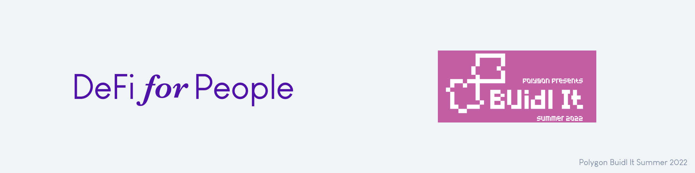

# Polygon Buidl It Summer 2022

## Inspiration

We are a South-American team (Argentina and Chile). In the last months, we could see a huge growing adoption of cryptocurrencies in our countries because of how broken the traditional finance system is here.

However, we noticed that people who are into cryptocurrencies, only buy and hold them speculating with the price. They don’t invest their assets, despite of the great quantity of opportunities that DeFi has.

The problem is the quantity of scams that makes people distrust, and the amount of things to do and information on DeFi, could be overwhelming and difficult to understand for a beginner.

So, our **inspiration** is building a platform where people can understand, learn and invest in DeFi in a simplified way, in order to introduce them to this amazing world of **decentralized finance**.

## What it does

- Makes the onboarding to the people with a series of questions, explaining financial concepts
- Explains the strategies for people to understand them and evaluating which is the better option
- Implements all the logic that strategies requires, with smart contracts
- Updates the balances in the dashboard for the user to be easier to monitor his investments
- Makes the process of learning and investing on DeFi simpler and nicer 😀

## How we built it

### Frontend

- Webapp built in React with TypeScript language.
- For the UI we are used Chrakra UI library.
- For the connection to the Blockchain and the backend process we are used our bulilt-in synchronizer and their functionality (Automatic contract sync, Database, Functions, web3 API)
- Ether js the make the transactions with the Blockchain;

### Backend/Blockchain

- Hardhat to development for smart contract
- Waffle
- AWS:
  - EC2 = Instance of Linux VM
  - RDS = Postgres DB
  - Route53 = DNS domine administration "[defiforpeople.com](http://defiforpeople.com/)"
- Chainlink:
  - Data Feeds Oracles for get tokens / USD prize
- Aave V3 and Uniswap V3 DeFi protocols

## Challenges we ran into

We didn’t like the backend products related to blockchain that there is the market out there, so we decided to build our own built-in synchronizer that keeps synced the blockchain data, with the backend, with the front. This is very useful and made work way simpler for us. Is useful for giving a better UI/UX to the user, explaining what is happening in each transaction and updating his balances in the dashboard.

**Uniswap** **V3** is quite complex to use through smart contracts. It took some time to understand how to interact with it correctly.

The front was hard to accomplish, given the complexity of the UI/UX, but we are happy with how it ended up.

## Accomplishments that we're proud of

We could deliver a good product that satisfy our expectancies.

Also we improved a lot our dev tools and the tech we use, so it makes easy developing with them. Now we can develop products faster and also scaling is easier for us too.

## What we learned

We learned A LOT about building in web3: creating and testing smart contracts, UI/UX, the integration of the contract with the off-chain, Uniswap V3, Aave, and what the blockchains like Polygon has to offer us.

We learned how difficult, powerful, and exciting building in web3 is.

## What's next for DeFi for People

We will keep improving our UI/UX.
We will add more tested strategies with good performing for people to invest in.

We want to build a community, with people helping each others, while they accomplish their first steps on DeFi, having a Discord and social media presence.

Make the community take the decision, for example the tokens the strategy

We will set a roadmap
